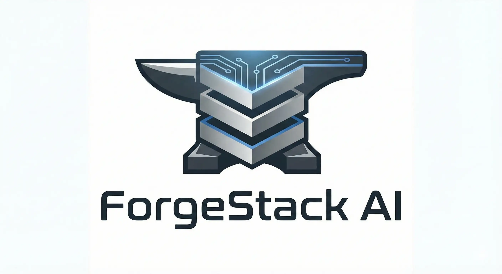

<p align="center">
  
</p>

# ForgeStack AI

**The Opinionated Flutter Scaffolder at the Speed of Thought.**

ForgeStack AI is an AI-driven architect that automates the creation of production-grade Flutter environments. It enforces a strict **Clean Architecture**—ensuring your code remains scalable, testable, and clean from the very first commit.

---

## Why ForgeStack?

Most scaffolders give you a folder structure. **ForgeStack gives you a foundation.** It utilizes a dual-engine AI approach to understand your project's intent and wire up the boilerplate specifically for your needs.

### The Production-Ready Standard

* **Architecture:** Strict Clean Architecture (`core`, `shared`, `features`).
* **State Management:** `flutter_riverpod` + `flutter_hooks`.
* **Navigation:** Type-safe `go_router` with pre-configured paths.
* **Networking:** `dio` with pre-built interceptors and base configurations.
* **Data Models:** Immutable classes with `freezed` & `json_serializable`.

---

## Dual-Engine Intelligence

ForgeStack v2.0 allows you to switch between specialized AI providers:

| Provider | Engine | Best For |
| --- | --- | --- |
| **GitHub Copilot** | GPT-4o | Seamless ecosystem integration and speed. |
| **Deepseek** | Deepseek-Reasoner | Complex architectural reasoning and precision logic. |

---

## Quick Start

### 1. Installation & Config

```bash
git clone https://github.com/JorgeAntonio/forgestack-AI
cd forgestack-ai
npm install
```

Create a .env file:

```Plaintext
GITHUB_TOKEN=your_token_here
DEEPSEEK_API_KEY=your_key_here
```

### 2. Ignition

```bash
# Development mode
npm run dev

# Production build
npm run build && node dist/index.js
```

## How it Works

Select Engine: Choose between Copilot or Deepseek.

Brainstorm: Describe your app (e.g., "A fitness app with progress tracking").

Forge: The AI clarifies navigation (Bottom Nav / Drawer) and generates the entire scaffold.

💡 Pro Tip: Be specific. Instead of saying "auth", try "email and social auth with Firebase". ForgeStack will generate the feature folders and placeholders accordingly.

## Repository Structure

```Plaintext
src/
├── providers/     # AI Adapters (Copilot, Deepseek)
├── tools/         # The "Hands" (Flutter CLI & Scaffolding logic)
└── index.ts       # Orchestrator
```

## License

This project is licensed under the MIT License - see the [LICENSE](LICENSE) file for details.

## Contributing

Contributions are welcome! Please read the [CONTRIBUTING.md](CONTRIBUTING.md) file for details.
